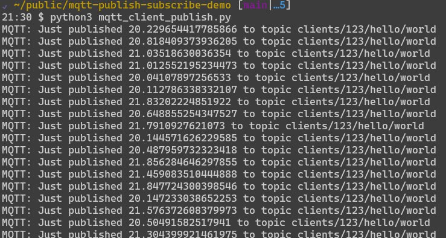
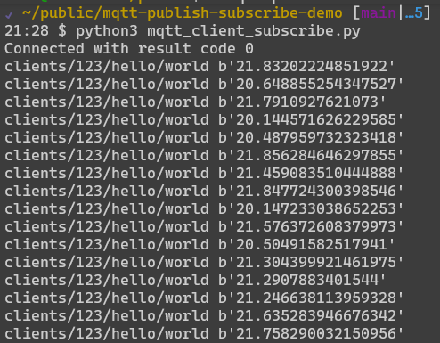
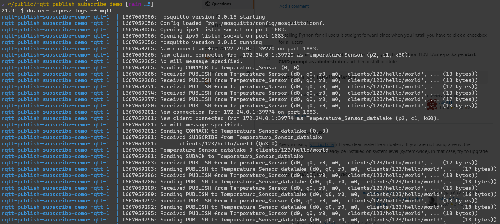

= MQTT publish and Subscribe Demo

Mosquitto broker and `paho.mqtt` client for publish and subscribe.

:toc: left

== Prerequisites

* Install Docker
* Install Docker-Compose
* Install Python3
* Install `paho.mqtt`

All steps for unix based deployment.

=== Docker

[source,bash]
----
curl -sSL https://get.docker.com/ | sh
sudo usermod -aG docker ${USER}
----

=== Docker Compose

[source,bash]
----
sudo curl -sSL https://github.com/docker/compose/releases/download/v2.12.2/docker-compose-linux-x86_64 -o /usr/local/bin/docker-compose
sudo chmod +x /usr/local/bin/docker-compose
----

=== Python3

[source,bash]
----
sudo apt-get install python3
sudo apt-get install python3-pip
----

=== paho.mqtt

[source,bash]
----
python3 -m pip install paho-mqtt
----

== Test

Bring-up the setup

[source,bash]
----
docker-compose up -d
----

=== Publish

[source,bash]
----
python3 mqtt_client_publish.py
----

=== Subscribe

[source,bash]
----
python3 mqtt_client_subscribe.py
----

